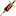

# Steroid Planet

## Introduction

Steroid Planet adds a high-stakes bodybuilding system to Minecraft! Unlock tiered steroids (I/II/III) to boost muscle
mass, reduce body fat, and chase extreme milestones like "Fat Loss Master" (≤10% body fat) or "Steroid Master" (use 9
types of steroid). Track critical stats—muscle, liver health, and body fat—with risky tradeoffs: steroids grant power
but risk permanent liver damage. Earn challenge-tier advancements, unique rewards, and face the consequences of reckless
fitness pursuit in this adrenaline-fueled progression mod.

## Features

### Effects

| Effect       | Icon                                                                                      | ID                            | Translation Key                      | Description                                                                                                                                                                                  |
|--------------|-------------------------------------------------------------------------------------------|-------------------------------|--------------------------------------|----------------------------------------------------------------------------------------------------------------------------------------------------------------------------------------------|
| Contest Prep |  | `steroid_planet:contest_prep` | `effect.steroid_planet.contest_prep` | There is absolutely no `Muscle` loss during contest preparation                                                                                                                              |
| Tech Fitness |  | `steroid_planet:tech_fitness` | `effect.steroid_planet.tech_fitness` | There are `I`, `II`, `III` levels, each level has different effects. Tech fitness can increase the efficiency of `Muscle` building and `BodyFat` loss, while causing damage to `LiverHealth` |

### Player Attributes

| Attribute    | Type  | NBT Key       | Default Value | Description                                                                                                                                                                                                                                                                                                                                                                                                                                                                                     |
|--------------|-------|---------------|---------------|-------------------------------------------------------------------------------------------------------------------------------------------------------------------------------------------------------------------------------------------------------------------------------------------------------------------------------------------------------------------------------------------------------------------------------------------------------------------------------------------------|
| Body Fat     | Float | `BodyFat`     | `30.0F`       | Body fat is valued from `0.0FF` to `100.0F`, and body fat stops muscle growth because the sum of `Muscle` and `BodyFat` is `100.0F`. Eating foods with labels `steroid_planet:fat_i`, `steroid_planet:fat_ii`, or `steroid_planet:fat_iii` can increase body fat. Players need to lose fat by running and swimming, and `steroid_planet:tech_fitness` effect can accelerate fat loss.                                                                                                           |
| Liver Health | Float | `LiverHealth` | `100.0F`      | Liver health values are taken from `0.0F` to `100.0F`. When player's `LiverHealth` value is below `15.0F`, he/she will continue to be harmed by `steroid_planet:liver_poisoning`, and the lower the liver health, the higher the damage multiplier, at the same time, the top of the head becomes pointed. Players can restore liver health by sleeping and eating foods with tag `#steroid_planet:liver_healing_i`, `#steroid_planet:liver_healing_ii` or `#steroid_planet:liver_healing_iii`. |
| Muscle       | Float | `Muscle`      | `0.0F`        | Muscle is valued from `0.0F` to `100.0F`, and the `Muscle` value can increase digging speed and attack power. Players can gain `Muscle` through exercise, including digging blocks and fighting, as well as eating foods with `steroid_planet:protein` tags. Having a `steroid_planet:tech_fitness` effect will increase the efficiency of diet and exercise.                                                                                                                                   |

### Damage Types

| Damage Type     | ID                               | Death Message                                                                              | Description                                                                                                                                                                                                                                                                                         |
|-----------------|----------------------------------|--------------------------------------------------------------------------------------------|-----------------------------------------------------------------------------------------------------------------------------------------------------------------------------------------------------------------------------------------------------------------------------------------------------|
| Liver Poisoning | `steroid_planet:liver_poisoning` | RIP `YOUR NAME`. Abused too many vet steroids and moved to the steroid planet permanently. | A persistent damage effect that activates when the player's `LiverHealth` falls below `15.0F`. The damage dealt scales inversely with `LiverHealth` (lower values mean higher damage multiplier), and the player's head model is visually altered to appear pointed for the duration of the effect. |

### Items

### Items

| Item                         | ID                                           | Texture                                                                                            | Translation Key                                   | Description                                                                                                            |
|------------------------------|----------------------------------------------|----------------------------------------------------------------------------------------------------|---------------------------------------------------|------------------------------------------------------------------------------------------------------------------------|
| Bodybuilding Champion Trophy | `steroid_planet:champion_trophy`             |              | `item.steroid_planet.champion_trophy`             | Grants the `effect.steroid_planet.contest_prep` effect for `9600` ticks and restores `20.0F` of LiverHealth when used. |
| CIS Trenbolone               | `steroid_planet:cis_trenbolone`              |               | `item.steroid_planet.cis_trenbolone`              | Grants `steroid_planet:tech_fitness` (Tier `II`) for `3600` ticks and inflicts `15.0F` instant LiverHealth damage.     |
| Methenolone                  | `steroid_planet:methenolone`                 |                  | `item.steroid_planet.methenolone`                 | Grants `steroid_planet:tech_fitness` (Tier `I`) for `3600` ticks and inflicts `5.0F` instant LiverHealth damage.       |
| Nandrolone                   | `steroid_planet:nandrolone`                  |                   | `item.steroid_planet.nandrolone`                  | Grants `steroid_planet:tech_fitness` (Tier `I`) for `3600` ticks and inflicts `5.0F` instant LiverHealth damage.       |
| Nandrolone Decanoate         | `steroid_planet:nandrolone_decanoate`        |         | `item.steroid_planet.nandrolone_decanoate`        | Grants `steroid_planet:tech_fitness` (Tier `I`) for `3600` ticks and inflicts `6.0F` instant LiverHealth damage.       |
| Nandrolone Phenylpropionate  | `steroid_planet:nandrolone_phenylpropionate` |  | `item.steroid_planet.nandrolone_phenylpropionate` | Grants `steroid_planet:tech_fitness` (Tier `I`) for `9600` ticks and inflicts `7.0F` instant LiverHealth damage.       |
| Oxandrolone                  | `steroid_planet:oxandrolone`                 |                  | `item.steroid_planet.oxandrolone`                 | Grants `steroid_planet:tech_fitness` (Tier `I`) for `3600` ticks and inflicts `7.0F` instant LiverHealth damage.       |
| Oxymetholone                 | `steroid_planet:oxymetholone`                |                 | `item.steroid_planet.oxymetholone`                | Grants `steroid_planet:tech_fitness` (Tier `II`) for `3600` ticks and inflicts `16.0F` instant LiverHealth damage.     |
| Stanozolol                   | `steroid_planet:stanozolol`                  |                   | `item.steroid_planet.stanozolol`                  | Grants `steroid_planet:tech_fitness` (Tier `I`) for `3600` ticks and inflicts `12.0F` instant LiverHealth damage.      |
| Stenbolone                   | `steroid_planet:stenbolone`                  |                   | `item.steroid_planet.stenbolone`                  | Grants `steroid_planet:tech_fitness` (Tier `I`) for `3600` ticks and inflicts `13.0F` instant LiverHealth damage.      |
| Synthol                      | `steroid_planet:synthol`                     |                      | `item.steroid_planet.synthol`                     | Grants `steroid_planet:tech_fitness` (Tier `II`) for `9600` ticks and inflicts `17.0F` instant LiverHealth damage.     |
| Trenbolone                   | `steroid_planet:trenbolone`                  |                   | `item.steroid_planet.trenbolone`                  | Grants `steroid_planet:tech_fitness` (Tier `III`) for `3600` ticks and inflicts `18.0F` instant LiverHealth damage.    |
| Trenbolone Acetate           | `steroid_planet:trenbolone_acetate`          |           | `item.steroid_planet.trenbolone_acetate`          | Grants `steroid_planet:tech_fitness` (Tier `II`) for `3600` ticks and inflicts `19.0F` instant LiverHealth damage.     |
| Trestolone                   | `steroid_planet:trestolone`                  |                   | `item.steroid_planet.trestolone`                  | Grants `steroid_planet:tech_fitness` (Tier `III`) for `9600` ticks and inflicts `20.0F` instant LiverHealth damage.    |

> **Note**: If you use a mixture of steroids, you will append the duration to the existing `steroid_planet:tech_fitness`
> effect if you already have the effect and select the better level between the existing effect and the new effect.

### Advancement

### Advancement

| Advancement            | Icon Item ID                     | ID                                               | Title Translation Key                                               | Description                                                                   |
|------------------------|----------------------------------|--------------------------------------------------|---------------------------------------------------------------------|-------------------------------------------------------------------------------|
| Bodybuilding Champion  | `steroid_planet:champion_trophy` | `steroid_planet:adventure/bodybuilding_champion` | `advancements.steroid_planet.adventure.bodybuilding_champion.title` | Train your muscles to `90.0F` at least to win the championship                |
| Buff on Buff           | `steroid_planet:oxymetholone`    | `steroid_planet:adventure/buff_on_buff`          | `advancements.steroid_planet.adventure.buff_on_buff.title`          | Use steroids to superimpose current tech fitness effect                       |
| Fat Loss Master        | `minecraft:cake`                 | `steroid_planet:adventure/fat_loss_master`       | `advancements.steroid_planet.adventure.fat_loss_master.title`       | Reduce your body fat below `10.0F`                                            |
| Pointy Head            | `minecraft:pointed_dripstone`    | `steroid_planet:adventure/pointy_head`           | `advancements.steroid_planet.adventure.pointy_head.title`           | Liver health value is lower than `15.0F`                                      |
| Steroid Master         | `minecraft:dragon_head`          | `steroid_planet:adventure/steroid_master`        | `advancements.steroid_planet.adventure.steroid_master.title`        | Use `9` kinds of steroid and use at least one of them with effect level `III` |
| Newbie's First Steroid | `steroid_planet:stanozolol`      | `steroid_planet:adventure/tech_fitness_i`        | `advancements.steroid_planet.adventure.tech_fitness_i.title`        | Use any type of steroid with effect level `I`                                 |
| Noob to Hunk           | `steroid_planet:cis_trenbolone`  | `steroid_planet:adventure/tech_fitness_ii`       | `advancements.steroid_planet.adventure.tech_fitness_ii.title`       | Use any steroid with effect level `II`                                        |
| Steroid Hero           | `steroid_planet:trestolone`      | `steroid_planet:adventure/tech_fitness_iii`      | `advancements.steroid_planet.adventure.tech_fitness_iii.title`      | Use any steroid with effect level `III`                                       |

## License

[MIT License](LICENSE)

## Links

[Repository](https://github.com/Jaffe2718/steroid_planet)
[Releases](https://github.com/Jaffe2718/steroid_planet/releases)
[Issues](https://github.com/Jaffe2718/steroid_planet/issues)
[Modrinth](https://modrinth.com/mod/steroid_planet)
